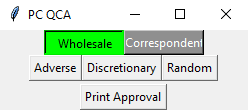
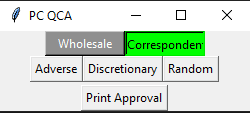

BytePro

Application with toggle buttons (PC2.py)
 - toggle for wholesale or correspondent channel (green highlight to confirm correct channel)
 - select audit type (calls qca2.py and print_app.py based on selection)
 - option to just print loan approval without completing qc screen when doing follow up work (calls print_app.py)

Find QC screen (qca2.py)
 - identify which 3 audit types
 - enter date in corresponding audit type field
 - select user 

Print loan approval (print_app.py)
 - timer is required since BytePro program lags at random intervals
 - select custom form
 - select document name
 - confirm print

Improvements needed
   - need different warning msg instead of just print stmts of failed steps
   - need to make user selectable option
